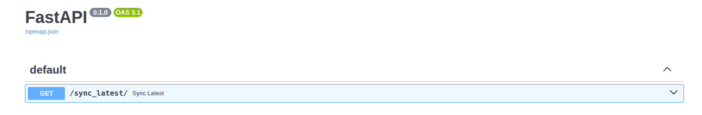

# Sync Zwift activities to Garmin

**Native integration between Zwift and Garmin does not count for challenges and distances and is not shared from Garmin to other services. This downloads the latest Zwift activity, changes the vendor and device and uploads it to Garmin. The work is based on https://github.com/marcelorodrigo/zwift-to-garmin, but unfortunately, the Python way of updating the .fit file did not work for me. So in my setup, I am using the Garmin SDK (https://developer.garmin.com/fit/download/) in a docker image. It uses FastAPI to publish the method as REST endpoint and to integrate this into other services.**

## Usage

- create .env file with access credentials
```
ZWIFT_USERNAME=my_zwift_username
ZWIFT_PASSWORD=my_zwift_password
GARMIN_USERNAME=my_garmin_username
GARMIN_PASSWORD=my_garmin_password
```

- get Garmin MFA token
```
docker compose run zwift_to_garmin get_mfa_token.py
```

- update docker compose file (if not run behind a reverse proxy, ports need to be published), e.g.:
```
services:
  zwift_to_garmin:
    build: 
      dockerfile: Dockerfile_distroless
    image: ghcr.io/pgastinger/zwift_to_garmin:latest
    container_name: zwift_to_garmin
    environment:
      - GARMIN_PASSWORD=${GARMIN_PASSWORD}
      - GARMIN_USERNAME=${GARMIN_USERNAME}
      - ZWIFT_USERNAME=${ZWIFT_USERNAME}
      - ZWIFT_PASSWORD=${ZWIFT_PASSWORD}
    volumes:
      - ./data:/app/data
    restart: unless-stopped
    ports:
      - "8000:8000"
```

- Run container

```
(py312venv) peter@vps25:~/container/zwift-to-garmin$ docker compose up -d
[+] up 1/1
(py312venv) peter@vps25:~/container/zwift-to-garmin$ docker logs zwift_to_garmin                                                                                                                                                                                                                                0.1s 
INFO:     Will watch for changes in these directories: ['/app']
INFO:     Uvicorn running on http://0.0.0.0:8000 (Press CTRL+C to quit)
INFO:     Started reloader process [1] using WatchFiles
INFO:     Started server process [8]
INFO:     Waiting for application startup.
INFO:     Application startup complete.

```

